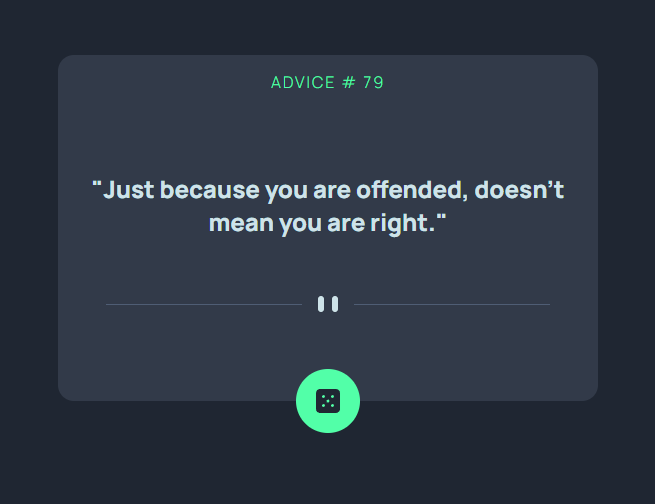
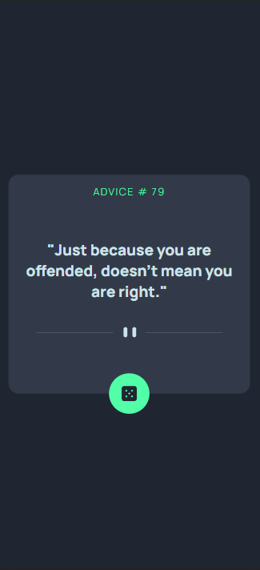
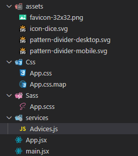

This is a solution to the [Advice generator app challenge on Frontend Mentor](https://www.frontendmentor.io/challenges/advice-generator-app-QdUG-13db). Frontend Mentor challenges help you improve your coding skills by building realistic projects.

## Table of contents

- [Overview](#overview)
  - [The challenge](#the-challenge)
  - [Screenshot](#screenshot)
  - [Links](#links)
- [My process](#my-process)
  - [Built with](#built-with)
  - [Folders](#folders)
  - [Code Explanation](#code-explanation)
  - [Useful resources](#useful-resources)
- [Author](#author)

## Overview

### The challenge

Users should be able to:

- View the optimal layout for the app depending on their device's screen size
- See hover states for all interactive elements on the page
- Generate a new piece of advice by clicking the dice icon

### Screenshot

#### Desktop 


#### Mobile


### Links

- [Solution URL](https://www.frontendmentor.io/solutions/advice-app-with-api-and-responsive-layout-tnD03gx4zd)
- [Live Site URL](https://rickhalmoguera.github.io/Advice-generator-react/)

## My process

### Built with

- Semantic HTML5 markup
- CSS custom properties
- Flexbox
- CSS Grid
- Mobile-first workflow
- ReactJS

## Folders


## Code Explanation

### App Component

```js
export default function App() {
    const [advice, setAdvice] = useState()
    
    useEffect(() => {
        API.GetAdvice().then(setAdvice)
    }, [])

    const handleClick = () => {
        API.GetAdvice().then(setAdvice)
    }

    if(!advice) {
        return (
            <div className='card'>
                <p className='card__title'>advice</p>
                <p className='card__text'>Loading...</p>
                <picture>
                    <source srcSet={dividerDesktop} media='(min-width: 600px)'/>
                    
                </picture>
                <div   className='card__btn'>
                    
                </div>
            </div>
                )
    }

  return (
    <div className='card'>
        <p className='card__title'>advice # {advice.id}</p>
        <p className='card__text'>"{advice.advice}"</p>
        <picture>
            <source srcSet={dividerDesktop} media='(min-width: 600px)'/>
            
        </picture>
        <div  onClick={handleClick} className='card__btn'>
            
        </div>
    </div>
  }
```
This component holds state using the "useState" hook, which sets and manages the state of the "advice" variable. It also uses the "useEffect" hook to fetch data from an API endpoint via a function called "GetAdvice" when the component first mounts, then updates the "advice" state with the fetched data using "setAdvice".

The "handleClick" function is used to fetch new data from the same "GetAdvice" function and set the "advice" state again.

If the "advice" state is null or undefined, the component will return a loading screen UI with a dice image. Once the advice state has been set, the component will display the advice along with its ID.

All class names were assigned using the BEM methodology, which makes them more easily understandable.

### advice.js 

```js
const API_URL = 'https://api.adviceslip.com/advice'

export async function GetAdvice() {

    try{
        const response = await fetch(API_URL)
        const data = await response.json()
        return data.slip
    }catch(error){
        return error
    }
}

```

This code exports an asynchronous function called "GetAdvice" that makes a HTTP GET request to the API endpoint defined in the constant "API_URL."

When executed, it first waits for the response from the API using the fetch method. Once the response is received, it processes the response data into JSON format using the .json() method.

The returned data from the API is expected to have a property called "slip". This GetAdvice function returns the "slip" object.

If there is an error while sending or receiving the request, the function returns the error object.

### API response
```js
  {
    "slip": {
      "slip_id": "2",
       "advice": "Smile and the world smiles with you. Frown and you're on your own."
    }
  }
```

## Useful resources

- [Drop shadow generator](https://webcode.tools/generators/css/drop-shadow) - This helped me to make the shadow effect in the button.
- [JavaScript Fetch API](https://www.w3schools.com/jsref/api_fetch.asp) - This is an amazing article which helped me finally understand the use of fecth.
- [REACT ⚛️ CURSO Práctico DESDE CERO - Desarrolla una app con React.js PASO A PASO](https://www.youtube.com/watch?v=4AFOCAgywLc) - This short course help me to understand how to fetch in React using useState() and useEffect()


## Author

- Github - [Ricardo Halmoguera](https://github.com/RickHalmoguera)
- Frontend Mentor - [@RickHalmoguera](https://www.frontendmentor.io/profile/RickHalmoguera)
